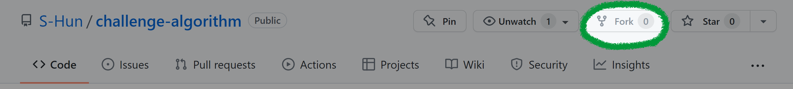

# **🐱‍🏍 알고리즘 도전**

_Goal_ : 효율적인 프로그래밍 습관을 위하여! 

  

# **📙 규칙**

## **기본 사용법**

1. [원본 저장소](https://github.com/S-Hun/challenge-algorithm)를 개인 저장소로 Fork한다.
2. 내 계정명으로 폴더(_ex. ~/challenge-algorithm/s-hun_)를 만든다. 
3. 계정명에 답안 파일을 생성하고 아래의 규칙에 따라 커밋(main branch)한다.
4. 내 개인 저장소에 push한 뒤에 PR을 작성한다.

 

## **파일명 규칙**
- 파일 이름과 확장자는 자유롭게 지정 (txt, pdf, 없음 등)
- 코드 주석 외의 잡다한 설명을 포함하지 않을 것

 

## **_Commit_ 작성 규칙**
commit 메세지: [문제_출처_플랫폼] 문제이름 / 난이도 / 걸린시간 description: 문제 주소 (option)

터미널에서 작성법: `git commit -m "[BOJ] Hello World / 브론즈5 / 1분" -m "https://www.acmicpc.net/problem/2557"`

- **문제 출처 플랫폼 목록<a href='https://github.com/ellynhan/challenge100-codingtest-study'>FROM</a>**
    * [BOJ] - 백준
    * [PGS] - 프로그래머스
    * [LTC] - 리트코드
    * [CFS] - 코드포스
    * [SEA] - 삼성SW Expert Academy
    * [ETC] - 그외

 

## **_Pull Request_ 작성 규칙**
PR 제목 : `Github_ID / 주차 / 푼 문제수`

(_ex. S-Hun / 4월 1주 / 2문제_)

comment에는 알고리즘 분류나 문제에 대한 평가등을 적어주시고
작성은 자유롭게 하시면 됩니다.

 

## **할당량**
1. 문제에 관계없이 **주 1회 이상** 반드시 PR을 작성할 것
    - 매주 토요일( 또는 일요일 )마다 PR 승인

  
